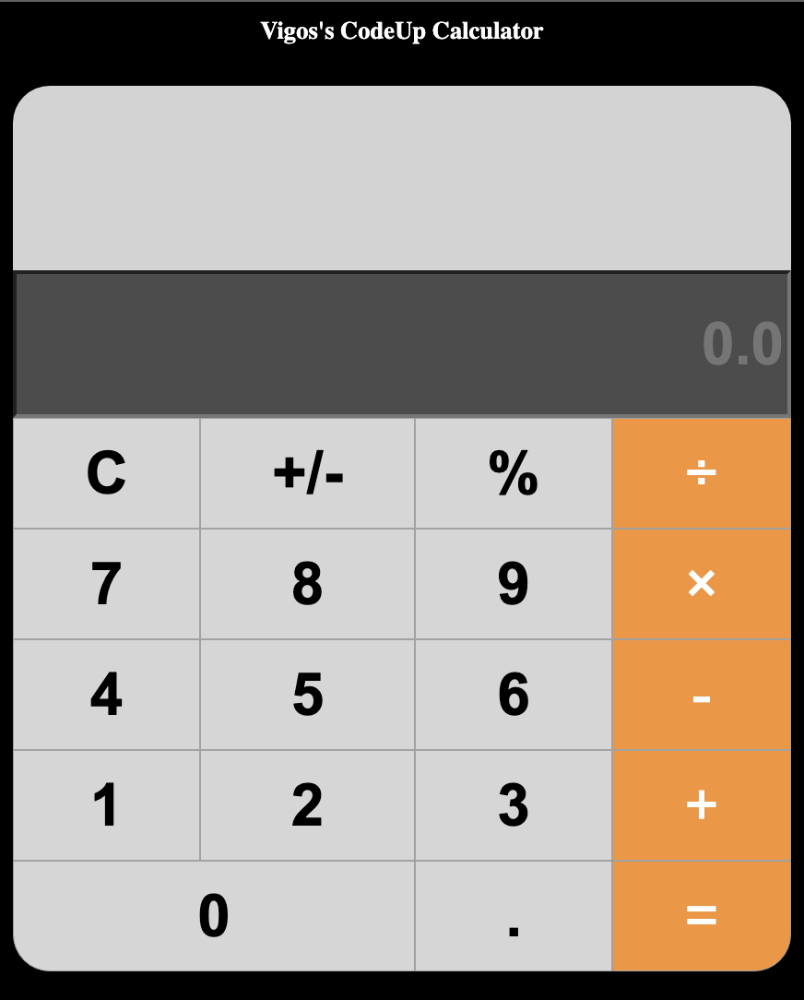

# Vanilla JS Calculator for CodeUp Java Cohort

I created this project under the direction of Kenneth Howell my instructor at CodeUp Java Cohort as a side project.

## How to run it

1. Download NPM [NPM DOWNLOAD](https://docs.npmjs.com/downloading-and-installing-node-js-and-npm)
2. Install all dependencies with "npm i"
3. Run the project with "serve ./" from the root of the project

## Thanks for reading! And Keep on Coding!
